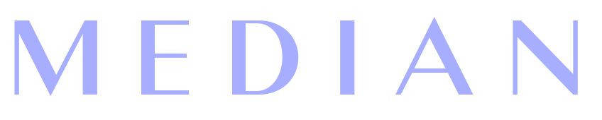

A GraphQL based feature rich blogging API.

See full documentation [HERE](https://median-api-docs.netlify.app/) for API docs, configuration and deployment options.

---

## Local Setup

> Optional: import demo data in your mongo instance `mongorestore --verbose ./db-demo`

### Docker

- `docker compose up`
> Make changes in `docker-compose.yml` if required

### Local machine

- Clone this repo: `git clone https://github.com/deprov447/median-server`
- Run `npm install`
- Setup environment variables :
  - Create a `.env` file in root directory of the project
  - Insert these 3 keys/value pairs :
    - **PORT** : _< Port on which server will listen >_
    - **DB_ADDR** : _< Mongo database connection URI >_
    - **SECRET** : _< Secret key for signing auth tokens >_
- Start the server: `npm start`
- Start requesting from a client (eg: `http://localhost:<PORT>/client`)

[Dockerhub](https://hub.docker.com/r/deprov447/median-api):`docker pull deprov447/median-api`

---

# Features

## Lightweight

Median API is very lightweight as compared to other REST based API. And the main reason is that you get only the content you request for, which is not possible (or atleast cumbersome) in REST architecture.

## Platform Agnostic

The API is fully platform agnostic, ie any client on any platform can use this API. These include React application, Angular, Electron, Flutter, Native desktop apps on Qt etc. The possibilities are endless.

> Even if your platform doesnt have a library to make graphQL based request, you can use Median. See: (a blog reg this)

## Open Source

The API is fully open source, you can freely host it on your own server with all the customizations you want.

---

## Buy me a coffee

Whether you use this project, have learned something from it, or just like it, please consider supporting it by buying me a coffee, so I can dedicate more time on open-source projects like this :)

---

## License

This project is licensed under the terms of the **MIT** license.
